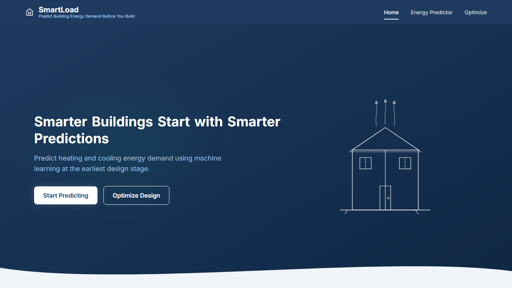
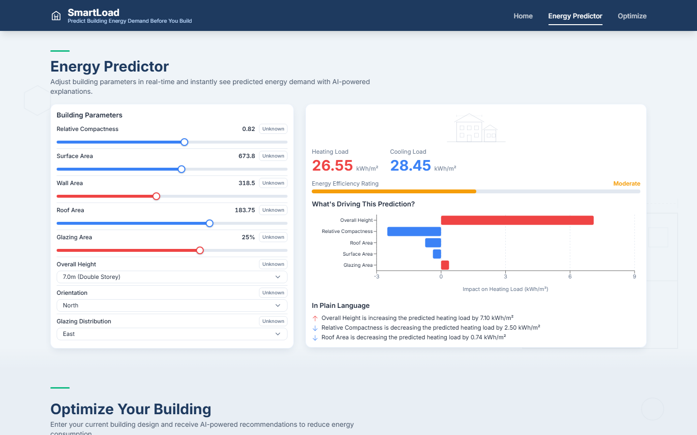
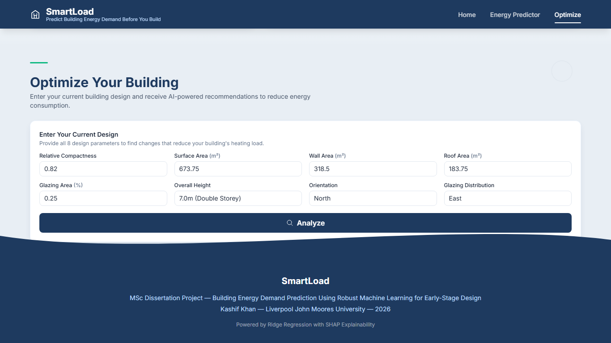
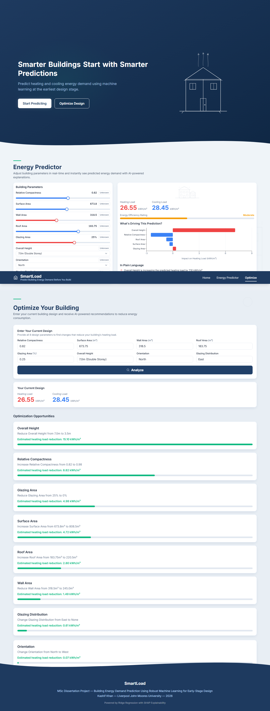

# SmartLoad

**Predict Building Energy Demand Before You Build**

SmartLoad is a website that predicts a building's heating and cooling
energy demand from early-stage architectural design parameters — compactness, surface
area, wall/roof area, height, orientation, and glazing — using a trained Ridge Regression
model with SHAP-based explainability. It's built as a FastAPI backend serving the model,
paired with a React/Vite single-page frontend.

## Screenshots

**Landing page**


**Energy Predictor — real-time prediction with SHAP explanation**


**Optimize — enter a design, get ranked recommendations**



## Project Structure

```
SmartLoad/
├── backend/               # FastAPI app (Ridge Regression + SHAP), see backend/CLAUDE.md
├── smartload-frontend/    # React + Vite + Tailwind + Motion frontend
├── screenshots/           # App showcase screenshots (used above)
├── test_screenshots/      # Screenshots captured during the QA pass
└── test_report.md         # Full backend + frontend test report
```

## Tech Stack

- **Backend:** Python, FastAPI, scikit-learn (Ridge Regression), SHAP, joblib, numpy
- **Frontend:** React 18, Vite, Tailwind CSS, Motion (Framer Motion), Recharts, Axios

## Running Locally

**Backend** (`localhost:8000`):
```bash
cd backend
pip install -r requirements.txt
uvicorn main:app --reload --port 8000
```

**Frontend** (`localhost:5173`):
```bash
cd smartload-frontend
npm install
npm run dev
```

The frontend expects the backend running on `localhost:8000` (CORS is open for local dev).
See [`backend/CLAUDE.md`](backend/CLAUDE.md) and [`smartload-frontend/CLAUDE.md`](smartload-frontend/CLAUDE.md)
for architecture details, and [`test_report.md`](test_report.md) for the full QA pass covering
normal use, edge cases, and failure handling.


